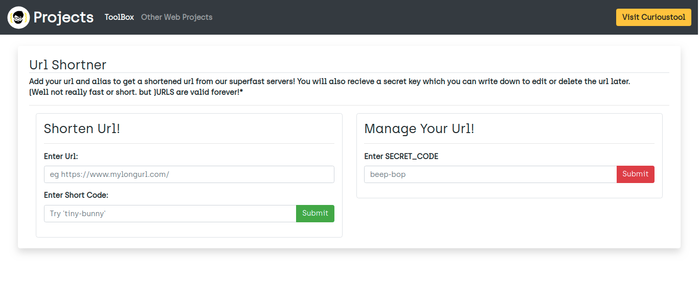

# url-shortner





This is a server based url shortner app made using flask(python)  and bootstrap. it can be used to shorten your urls to whatever alias you want. this also provides a secret key to edit or delete the shortlink. the application is live at : http://curioustools.herokuapp.com/


**Done**

- [x] basic url shortner : will generate a route for long urls based onshort code
- [x] manage url via secret key
- [x] ui/ux using bootstrap


## Setup(For linux platform)

```python

0. <install python3 ,pip3>
1. git clone <this repo url>
2. cd url-shortner

$ python3 -m venv env
$ source env/bin/activate
(env) $ pip3 install -r requirements.txt
     ...
     ...
     ...
(env) $ pip3 flask run

```
